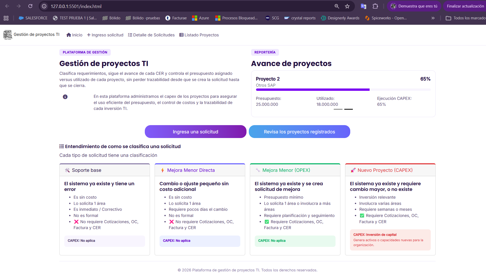

# G2-2026-Diplomado-FullStack

> Proyecto del Módulo 1 — HTML + CSS + JS · Diplomado Fullstack IPSS
> Opción B — Mini-catálogo

## Integrantes

- Constanza Morales

## Descripción

Plataforma de gestión de proyectos TI: permite clasificar requerimientos, seguir el avance de cada CER y controlar el presupuesto asignado versus utilizado de cada proyecto, desde que se crea la solicitud hasta que se cierra.

## Vista del proyecto

## Páginas

### Home

"Plataforma de gestión de proyectos TI"
Explica cuales proyectos se van a considerar por su clasificación

### Listado de proyectos

Tabla con: ID, Proyecto, Sistema, Estado, Proveedor, Presupuesto asignado.

- Filtros por Estado (En proceso / Finalizado), Sistema (SAP / OTROS / etc.) y Proveedor.
- Barra de búsqueda por nombre de proyecto.

### Detalle

Ficha completa de un proyecto: descripción, CER, fechas, presupuesto asignado vs. utilizado, si tiene impacto financiero, tipo (mejora o funcionalidad nueva).

### Contacto este se considero como un ingreso de solicitud

Formulario simple (nombre, email, mensaje).

## Cómo correr localmente

Este proyecto usa `fetch()` para cargar componentes (navbar, footer, tabla), por lo que **no funciona abriendo los archivos directamente con doble clic** — necesitas un servidor local.
Pasos a seguir:

1. git clone https://github.com/conimorales/G2-2026-Diplomado-FullStack_Tarea1.git
2. cd G2-2026-Diplomado-FullStack_Tarea1
3. Levanta un servidor local. Puedes usar:
   - **VS Code**: instala la extensión Live Server, clic derecho sobre `index.html` → "Open with Live Server"

Alternativa: si usas VS Code, instala la extensión **Live Server**, clic derecho sobre `index.html` → "Open with Live Server".

## 📁 Estructura del proyecto

**_ componentes _**
en esta carpeta va el detalle de cada componente en el caso que se utilice la vista html en más de una tabla, con el fin de optimizar trabajo y no duplicar código

- footer.html este es el diseño del footer completo
- navbar.html este es el diseño del navbar completo
- request-detail.html este es el diseño de la tabla de detalle de solicitudes
- project-table.html este es listado de proyectos

**_ css _**
en esta carpeta se define el detalle del css utilizado

- base1.css es el detalle de css aplicado a todas las vistas
- contact.css es el css aplicado a la vista contacto, solamente
- home.css es el css aplicado en home

**_ data _**
en esta carpeta se cargo información de prueba para las tablas en formato json, con el fin de aplicar

- project-list.json Listado de proyectos
- request-details.json Detalle de solicitudes

**_ img _**
carpeta donde se guardan las imágenes

- Img1.png
- logo_proyecto.png
- Proyecto presupuesto.png
- Web.png

**_ javascript _**
archivos js

- contact.js detalla funcionamiento de formulario js
- footer.js llama al footer
- navbar.js llama el id del navbar
- project-list.js se utilizo para traer la información del json y unir la información con la tabla, además cuenta con un filtro en el estado de proyecto
- request-details.js mismo funcionamiento que project list

**_ Tarea 1 _**
Pautas de evaluación

- evaluacion-1-html-css-js.pdf
- rubrica-correccion-evaluacion-1.pdf

**_ OTROS _**

- contact.html vista donde se ingresan solicitudes
- document-manager.html vista donde se pretende cargar documentos y guardarlos en la bbdd, en este caso aún no se ha implementado esta vista
- index.html vista genérica del proyecto
- project-list.html html de listado de proyectos
- request-detail.html html de detalle de solicitudes
- Propuesta planificación de soporte.pptx presentación explicada de lo que se quiere lograr finalmente
